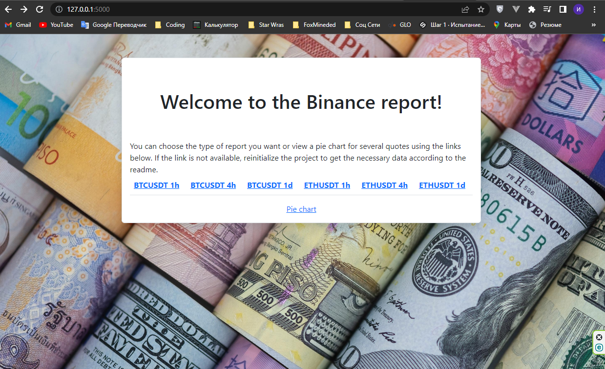
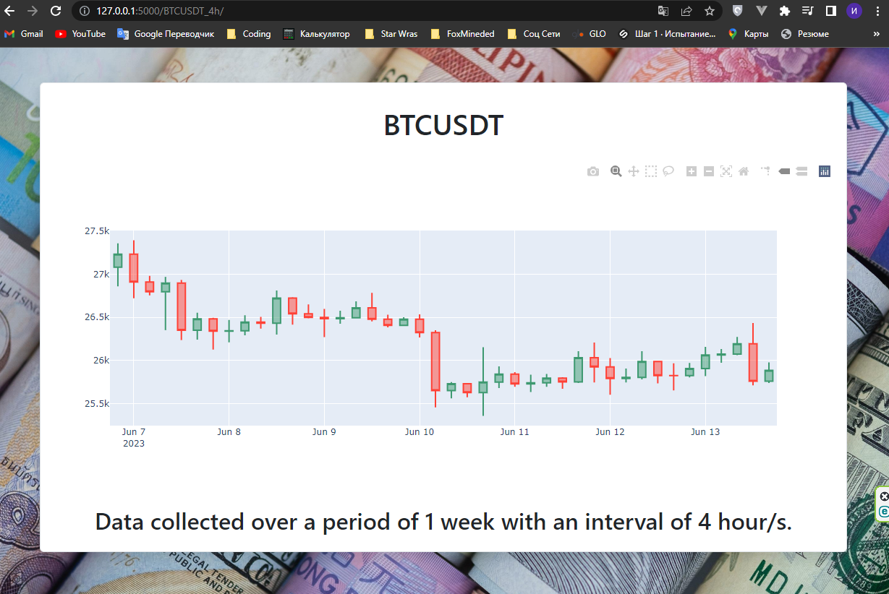
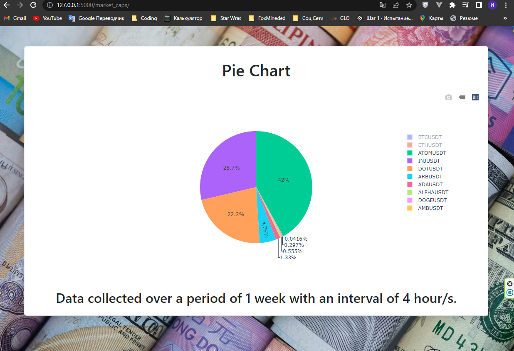

# Flask-Binance-Report-Diagramm

## Description
Simple Flask interface + script for downloading 
data from Binance API and generating charts based on downloaded data.

## Technologies used
`Python`, `Flask`, `celery`, `redis`, `peewee`, `argparse`, `sqlite3`, `plotly`, `pandas`

## Getting started

To make it easy for you to get started with Flask-Binance-Report-Diagramm, 
here's a list of recommended next steps.

## Download
Download the repository with this command: 
```bash
git clone https://github.com/Shtierlitz/Flask-Binance-Report-Diagramm.git
```

## Register at https://www.binance.com/
### You will need to go through the authentication procedure, put some money into the account and generate your own API keys.

## Create Files
You will need to create `.env` file and place it in the root of the project.
```bash
project/.env
```

### Required contents of the .env file:
```python
SECRET_KEY='<your SECRET key>'  
API_KEY="<API_KEY>"  
SECRET_KEY="<SECRET_KEY>"  
```
# WARNING!
## In no case do not add keys in any other place than .env and do not use where they can get into the public network. This can lead to hackers using your keys and being able to conduct any transactions on your account without your knowledge on your behalf.

# Localhost development (only)

## Flask run
### Preparations
First of all, create a virtual environment in the root repository near the `project/` folder.
I will explain all further commands using the example of Windows OS.
## Venv
You need to create a virtual environment and install all dependencies  

To create virtual environment go to the root directory and run:
```bash
python -m venv venv
```
Run virtual environment:
```bash
venv/scripts/activate
```

After you can install dependencies:
```bash
pip install -r requirements.txt
```

## Run get_and_create_data.py
Go to `project/` folder. You need to use argparse commands to initialize database and scv files.
Example:
```bash
python get_and_create_data.py --period "week" --num "1" --interval "4h" --update_interval "1h"
```
Where:  
--period is a day, week, month, or year.  
--num is the number of days, weeks, months, years.  
--interval is pre-market period
--update_interval is how often information will be updated.  

After the executed command, the `binance.db` file should appear in the `project/` folder 
and .csv files should be generated in the date folder.

## Redis cli run on Windows
Install Linux on Windows with WSL https://learn.microsoft.com/en-us/windows/wsl/install  
Install and run Redis cli https://redis.io/docs/getting-started/installation/install-redis-on-windows/  
Activate Ubuntu console and run:
```bash 
sudo service redis-server start  
redis-cli
```
## Celery  
### Celery Worker run on Windows
Go to the root folder and run in new terminal:
```bash
pip install eventlet  
celery -A project.app.celery worker --loglevel=info -P eventlet
```

## Celery beat
Run in new terminal:
```bash
celery -A project.app.celery beat --loglevel=info
```

## Run app
To run localhost server just open new terminal, get to the `project/` folder and then run the command:
```bash
flask run
```

Now you should be able to see these pages:  
http://127.0.0.1:5000/



http://127.0.0.1:5000/btc_usdt/BTCUSDT_4h/



http://127.0.0.1:5000/market_caps/




# Sources

Flask - https://flask.palletsprojects.com/en/2.3.x/  
peewee - http://docs.peewee-orm.com/en/latest/  
plotly - https://plotly.com/python/  
pandas - https://pandas.pydata.org/docs/user_guide/index.html#user-guide  
celery - https://docs.celeryq.dev/en/stable/userguide/periodic-tasks.html  


